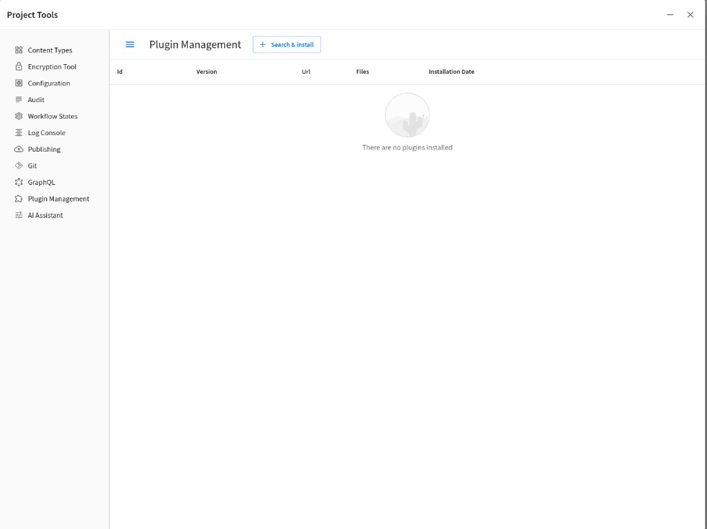
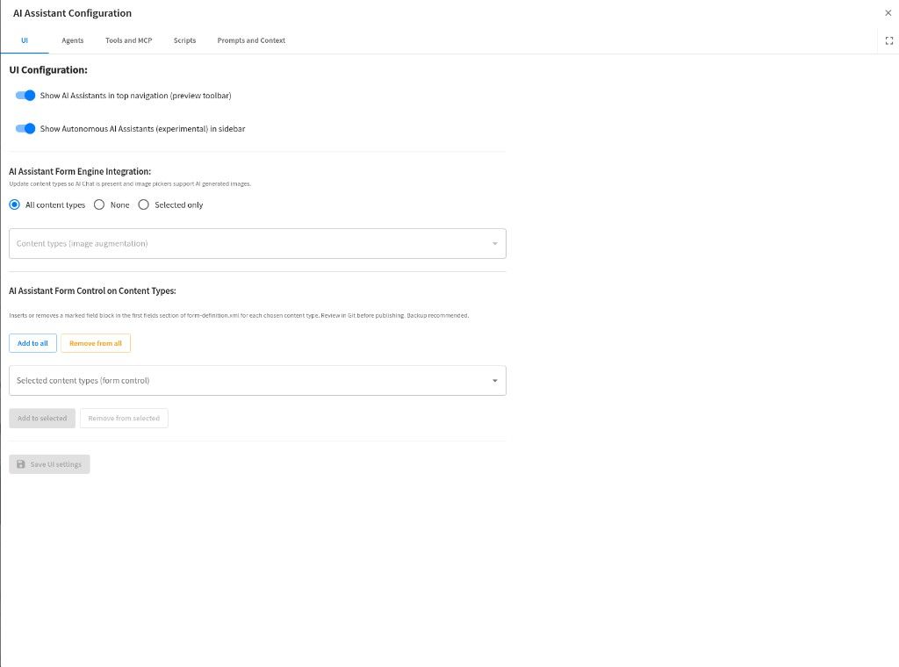

# Installing the Plugin

## Studio UI

Install via **Project Tools → Plugin Management → Search & install**.



After install, open **Project Tools → AI Assistant** for the tabbed **AI Assistant Configuration** dialog (UI flags, agents, tools/MCP, scripts, prompts). A quick view of the **UI** tab:



More tabs and captions: [Configuration guide — Screenshots](configuration-guide.md#cg-screenshots).

## Local / From-repo Install

From repo root (with `CRAFTER_DATA` and `CRAFTER_STUDIO_TOKEN` set when using the CLI or HTTP API), after **`yarn package`** in **`sources/`**:

| Method | Notes |
|--------|--------|
| **Studio Marketplace UI** | **Project Tools → Plugin Management** — search for the plugin and install it into the current site (same flow as [Studio UI](#studio-ui) above). |
| [CrafterCMS CLI](https://docs.craftercms.org/en/4.1/by-role/common/crafter-cli.html) `copy-plugin` | Point `--path` at this repository |
| Marketplace **`/studio/api/2/marketplace/copy`** | POST JSON `siteId` + `path` to the plugin directory |

Example **`copy`** body (replace site and path):

```json
{
  "siteId": "MySite",
  "path": "/absolute/path/to/plugin-studio-crafterq"
}
```

Example CLI:

```bash
./crafter-cli copy-plugin -e local -s MySite --path /absolute/path/to/plugin-studio-crafterq
```

Example **`curl`** (replace host, JWT, site, path):

```bash
curl --location --request POST 'http://localhost:8080/studio/api/2/marketplace/copy' \
  --header 'Authorization: Bearer YOUR_JWT_TOKEN' \
  --header 'Content-Type: application/json' \
  --data-raw '{"siteId":"MySite","path":"/absolute/path/to/plugin-studio-crafterq"}'
```

## Build Before Install

From **`sources/`**: `yarn install`, then **`yarn package`** (Rollup + form-control verify). See root **Contributing** for dev server vs package workflow.
